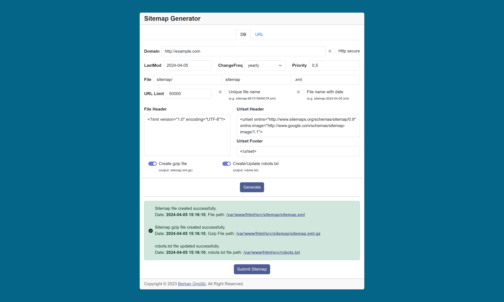

<div align="center" dir="auto">
    <a href="https://php.net">
        
    </a>
</div>
<br>
<p align="center">
<a href="https://www.php.net/releases/5_6_0.php" target="_blank" rel="nofollow">=v5.6-777BB4?logo=php&logoColor=white&labelColor=777BB4" alt="PHP Version"></a>
<a href="https://getbootstrap.com/docs/5.3/getting-started/introduction/" target="_blank" rel="nofollow"></a>
<a href="https://blog.jquery.com/2023/08/28/jquery-3-7-1-released-reliable-table-row-dimensions/" target="_blank" rel="nofollow"></a>
<a href="https://github.com/berkanumutlu/php-sitemap-generator/blob/master/LICENSE" target="_blank" rel="nofollow"></a>
</p>

# PHP Sitemap Generator

This project can be used to generate sitemaps. It can build a sitemap file from a list of URLs. The URLs may have attached the last modification date, change frequency, priority and image properties. URL limits can be added to sitemap files, gzip compression can be done, and the content of the robots.txt file can be updated automatically and the sitemap file can submit to search engines. It can craw the entered URL and create a sitemap file.

Sitemap format: http://www.sitemaps.org/protocol.html

## Sitemap file

~~After creating your sitemap.xml file, you should add the XML file to your `robots.txt`.~~

~~Line for the robots.txt:~~

~~Sitemap: http://example.com/sitemap/sitemap.xml~~

Now you can create or update your robots.txt automatically.

## Outputs

- Example output when generating a sitemap

```XML
<?xml version="1.0" encoding="UTF-8"?>
<urlset xmlns="http://www.sitemaps.org/schemas/sitemap/0.9" xmlns:image="http://www.google.com/schemas/sitemap-image/1.1">
    <!-- Created with PHP Sitemap Generator by Berkan Ümütlü (https://github.com/berkanumutlu/php-sitemap-generator) -->
    <url>
        <loc>http://example.com</loc>
        <lastmod>2024-04-03</lastmod>
        <changefreq>yearly</changefreq>
        <priority>0.5</priority>
    </url>
    <url>
        <loc>http://example.com/about-us</loc>
        <lastmod>2024-03-08</lastmod>
        <changefreq>yearly</changefreq>
        <priority>0.45</priority>
        <image:image>
            <image:loc>http://example.com/assets/images/pages/about-us.jpg</image:loc>
            <image:title>About Us</image:title>
        </image:image>
    </url>
    <url>
        <loc>http://example.com/uber-uns</loc>
        <lastmod>2024-03-08</lastmod>
        <changefreq>yearly</changefreq>
        <priority>0.45</priority>
    </url>
    <url>
        <loc>http://example.com/a-propos-de-nous</loc>
        <lastmod>2024-03-08</lastmod>
        <changefreq>yearly</changefreq>
        <priority>0.45</priority>
    </url>
    <url>
        <loc>http://example.com/sobre-nosotros</loc>
        <lastmod>2024-03-08</lastmod>
        <changefreq>yearly</changefreq>
        <priority>0.45</priority>
    </url>
    <url>
        <loc>http://example.com/o-nas</loc>
        <lastmod>2024-03-08</lastmod>
        <changefreq>yearly</changefreq>
        <priority>0.45</priority>
    </url>
    <url>
        <loc>http://example.com/%D9%85%D8%B9%D9%84%D9%88%D9%85%D8%A7%D8%AA-%D8%B9%D9%86%D8%A7</loc>
        <lastmod>2024-03-08</lastmod>
        <changefreq>yearly</changefreq>
        <priority>0.45</priority>
    </url>
    <url>
        <loc>http://example.com/chi-siamo</loc>
        <lastmod>2024-03-08</lastmod>
        <changefreq>yearly</changefreq>
        <priority>0.45</priority>
    </url>
    <url>
        <loc>http://example.com/hakkimizda</loc>
        <lastmod>2024-03-08</lastmod>
        <changefreq>yearly</changefreq>
        <priority>0.45</priority>
    </url>
    <url>
        <loc>http://example.com/contact</loc>
        <lastmod>2024-03-08</lastmod>
        <changefreq>yearly</changefreq>
        <priority>0.45</priority>
    </url>
    <url>
        <loc>http://example.com/kontakt</loc>
        <lastmod>2024-03-08</lastmod>
        <changefreq>yearly</changefreq>
        <priority>0.45</priority>
    </url>
    <url>
        <loc>http://example.com/contact-1</loc>
        <lastmod>2024-03-08</lastmod>
        <changefreq>yearly</changefreq>
        <priority>0.45</priority>
        <image:image>
            <image:loc>http://example.com/assets/images/pages/contact.png</image:loc>
            <image:title>Contact</image:title>
        </image:image>
    </url>
    <url>
        <loc>http://example.com/contacto</loc>
        <lastmod>2024-03-08</lastmod>
        <changefreq>yearly</changefreq>
        <priority>0.45</priority>
    </url>
    <url>
        <loc>http://example.com/kontakt-1</loc>
        <lastmod>2024-03-08</lastmod>
        <changefreq>yearly</changefreq>
        <priority>0.45</priority>
    </url>
    <url>
        <loc>http://example.com/%D8%A7%D8%AA%D8%B5%D8%A7%D9%84</loc>
        <lastmod>2024-03-08</lastmod>
        <changefreq>yearly</changefreq>
        <priority>0.45</priority>
    </url>
    <url>
        <loc>http://example.com/contatto</loc>
        <lastmod>2024-03-08</lastmod>
        <changefreq>yearly</changefreq>
        <priority>0.45</priority>
    </url>
    <url>
        <loc>http://example.com/iletisim</loc>
        <lastmod>2024-03-08</lastmod>
        <changefreq>yearly</changefreq>
        <priority>0.45</priority>
    </url>
</urlset>
```

- Example output when generating sitemap with gzip

```XML
<?xml version="1.0" encoding="UTF-8"?>
<sitemapindex xmlns="http://www.sitemaps.org/schemas/sitemap/0.9">
    <!-- Created with PHP Sitemap Generator by Berkan Ümütlü (https://github.com/berkanumutlu/php-sitemap-generator) -->
    <sitemap>
        <loc>http://example.com/sitemap/index/sitemap-1.xml</loc>
        <lastmod>2024-04-03</lastmod>
    </sitemap>
    <sitemap>
        <loc>http://example.com/sitemap/index/sitemap-10.xml</loc>
        <lastmod>2024-04-03</lastmod>
    </sitemap>
    <sitemap>
        <loc>http://example.com/sitemap/index/sitemap-11.xml</loc>
        <lastmod>2024-04-03</lastmod>
    </sitemap>
    <sitemap>
        <loc>http://example.com/sitemap/index/sitemap-12.xml</loc>
        <lastmod>2024-04-03</lastmod>
    </sitemap>
    <sitemap>
        <loc>http://example.com/sitemap/index/sitemap-13.xml</loc>
        <lastmod>2024-04-03</lastmod>
    </sitemap>
    <sitemap>
        <loc>http://example.com/sitemap/index/sitemap-14.xml</loc>
        <lastmod>2024-04-03</lastmod>
    </sitemap>
    <sitemap>
        <loc>http://example.com/sitemap/index/sitemap-15.xml</loc>
        <lastmod>2024-04-03</lastmod>
    </sitemap>
    <sitemap>
        <loc>http://example.com/sitemap/index/sitemap-16.xml</loc>
        <lastmod>2024-04-03</lastmod>
    </sitemap>
    <sitemap>
        <loc>http://example.com/sitemap/index/sitemap-17.xml</loc>
        <lastmod>2024-04-03</lastmod>
    </sitemap>
    <sitemap>
        <loc>http://example.com/sitemap/index/sitemap-2.xml</loc>
        <lastmod>2024-04-03</lastmod>
    </sitemap>
    <sitemap>
        <loc>http://example.com/sitemap/index/sitemap-3.xml</loc>
        <lastmod>2024-04-03</lastmod>
    </sitemap>
    <sitemap>
        <loc>http://example.com/sitemap/index/sitemap-4.xml</loc>
        <lastmod>2024-04-03</lastmod>
    </sitemap>
    <sitemap>
        <loc>http://example.com/sitemap/index/sitemap-5.xml</loc>
        <lastmod>2024-04-03</lastmod>
    </sitemap>
    <sitemap>
        <loc>http://example.com/sitemap/index/sitemap-6.xml</loc>
        <lastmod>2024-04-03</lastmod>
    </sitemap>
    <sitemap>
        <loc>http://example.com/sitemap/index/sitemap-7.xml</loc>
        <lastmod>2024-04-03</lastmod>
    </sitemap>
    <sitemap>
        <loc>http://example.com/sitemap/index/sitemap-8.xml</loc>
        <lastmod>2024-04-03</lastmod>
    </sitemap>
    <sitemap>
        <loc>http://example.com/sitemap/index/sitemap-9.xml</loc>
        <lastmod>2024-04-03</lastmod>
    </sitemap>
</sitemapindex>
```

- Example output when generating sitemap with url (e.g. https://www.google.com.tr)

```XML
<?xml version="1.0" encoding="UTF-8"?>
<urlset xmlns="http://www.sitemaps.org/schemas/sitemap/0.9" xmlns:image="http://www.google.com/schemas/sitemap-image/1.1">
    <!-- Created with PHP Sitemap Generator by Berkan Ümütlü (https://github.com/berkanumutlu/php-sitemap-generator) -->
    <url>
        <loc>https://www.google.com.tr</loc>
        <lastmod>2024-04-03</lastmod>
        <changefreq>yearly</changefreq>
        <priority>0.5</priority>
    </url>
    <url>
        <loc>https://www.google.com.tr/webhp?tab=ww</loc>
        <lastmod>2024-04-03</lastmod>
        <changefreq>yearly</changefreq>
        <priority>0.5</priority>
    </url>
    <url>
        <loc>https://www.google.com.tr/imghp?hl=tr&tab=wi</loc>
        <lastmod>2024-04-03</lastmod>
        <changefreq>yearly</changefreq>
        <priority>0.5</priority>
    </url>
    <url>
        <loc>https://maps.google.com.tr/maps?hl=tr&tab=wl</loc>
        <lastmod>2024-04-03</lastmod>
        <changefreq>yearly</changefreq>
        <priority>0.5</priority>
    </url>
    <url>
        <loc>https://play.google.com/?hl=tr&tab=w8</loc>
        <lastmod>2024-04-03</lastmod>
        <changefreq>yearly</changefreq>
        <priority>0.5</priority>
    </url>
    <url>
        <loc>https://www.youtube.com/?tab=w1</loc>
        <lastmod>2024-04-03</lastmod>
        <changefreq>yearly</changefreq>
        <priority>0.5</priority>
    </url>
    <url>
        <loc>https://news.google.com/?tab=wn</loc>
        <lastmod>2024-04-03</lastmod>
        <changefreq>yearly</changefreq>
        <priority>0.5</priority>
    </url>
    <url>
        <loc>https://mail.google.com/mail/?tab=wm</loc>
        <lastmod>2024-04-03</lastmod>
        <changefreq>yearly</changefreq>
        <priority>0.5</priority>
    </url>
    <url>
        <loc>https://drive.google.com/?tab=wo</loc>
        <lastmod>2024-04-03</lastmod>
        <changefreq>yearly</changefreq>
        <priority>0.5</priority>
    </url>
    <url>
        <loc>https://www.google.com.tr/intl/tr/about/products?tab=wh</loc>
        <lastmod>2024-04-03</lastmod>
        <changefreq>yearly</changefreq>
        <priority>0.5</priority>
    </url>
    <url>
        <loc>https://calendar.google.com/calendar?tab=wc</loc>
        <lastmod>2024-04-03</lastmod>
        <changefreq>yearly</changefreq>
        <priority>0.5</priority>
    </url>
    <url>
        <loc>https://translate.google.com.tr/?hl=tr&tab=wT</loc>
        <lastmod>2024-04-03</lastmod>
        <changefreq>yearly</changefreq>
        <priority>0.5</priority>
    </url>
    <url>
        <loc>https://books.google.com.tr/?hl=tr&tab=wp</loc>
        <lastmod>2024-04-03</lastmod>
        <changefreq>yearly</changefreq>
        <priority>0.5</priority>
    </url>
    <url>
        <loc>https://www.google.com.tr/shopping?hl=tr&source=og&tab=wf</loc>
        <lastmod>2024-04-03</lastmod>
        <changefreq>yearly</changefreq>
        <priority>0.5</priority>
    </url>
    <url>
        <loc>https://www.blogger.com/?tab=wj</loc>
        <lastmod>2024-04-03</lastmod>
        <changefreq>yearly</changefreq>
        <priority>0.5</priority>
    </url>
    <url>
        <loc>https://www.google.com/finance?tab=we</loc>
        <lastmod>2024-04-03</lastmod>
        <changefreq>yearly</changefreq>
        <priority>0.5</priority>
    </url>
    <url>
        <loc>https://photos.google.com/?tab=wq&pageId=none</loc>
        <lastmod>2024-04-03</lastmod>
        <changefreq>yearly</changefreq>
        <priority>0.5</priority>
    </url>
    <url>
        <loc>https://docs.google.com/document/?usp=docs_alc</loc>
        <lastmod>2024-04-03</lastmod>
        <changefreq>yearly</changefreq>
        <priority>0.5</priority>
    </url>
    <url>
        <loc>https://www.google.com.tr/intl/tr/about/products?tab=wh</loc>
        <lastmod>2024-04-03</lastmod>
        <changefreq>yearly</changefreq>
        <priority>0.5</priority>
    </url>
    <url>
        <loc>https://accounts.google.com/ServiceLogin?hl=tr&passive=true&continue=https://www.google.com.tr/&ec=GAZAAQ</loc>
        <lastmod>2024-04-03</lastmod>
        <changefreq>yearly</changefreq>
        <priority>0.5</priority>
    </url>
    <url>
        <loc>http://www.google.com.tr/preferences?hl=tr</loc>
        <lastmod>2024-04-03</lastmod>
        <changefreq>yearly</changefreq>
        <priority>0.5</priority>
    </url>
    <url>
        <loc>http://www.google.com.tr/history/optout?hl=tr</loc>
        <lastmod>2024-04-03</lastmod>
        <changefreq>yearly</changefreq>
        <priority>0.5</priority>
    </url>
    <url>
        <loc>http://www.google.com.tr/intl/tr/services/</loc>
        <lastmod>2024-04-03</lastmod>
        <changefreq>yearly</changefreq>
        <priority>0.5</priority>
    </url>
    <url>
        <loc>https://www.google.com.tr/setprefdomain?prefdom=US&sig=K_WltwMM1UMbkm6WgZ325bYn-jXa4%3D</loc>
        <lastmod>2024-04-03</lastmod>
        <changefreq>yearly</changefreq>
        <priority>0.5</priority>
    </url>
</urlset>
```

## Screenshots




## License

The MIT License (MIT). Please see [License File](LICENSE) for more information.